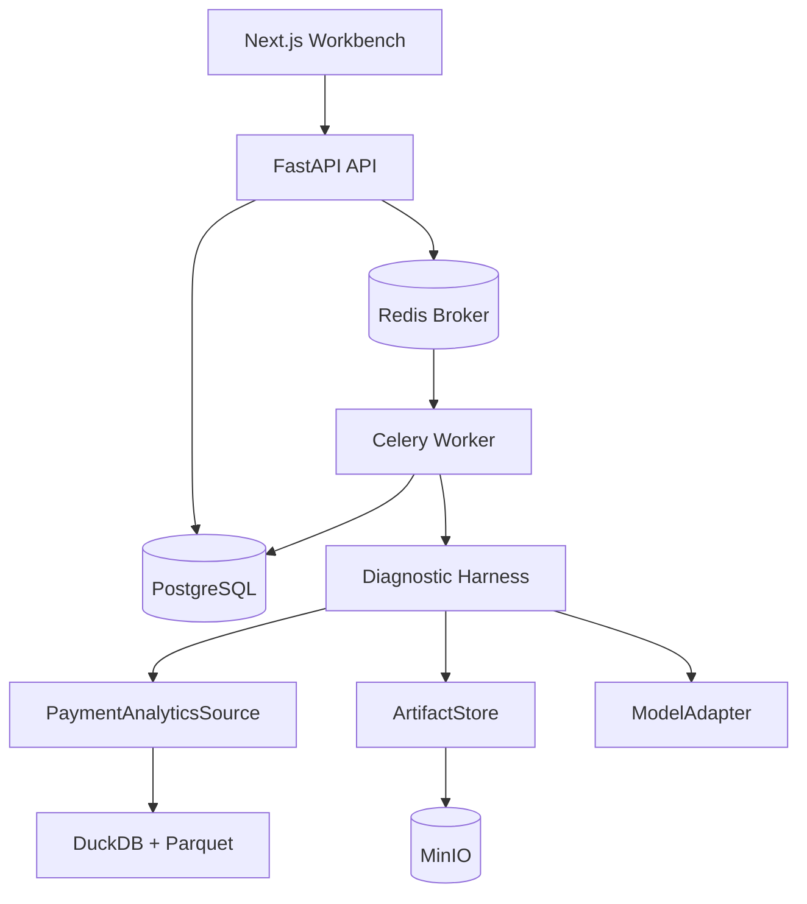

# PayTrace Production-shaped MVP 实现方案

> 版本：v0.2  
> 状态：待实施  
> 面向：Claude Code / Codex 等 Coding Agent  
> 项目定位：支付转化异常归因与诊断 Agent  
> 架构原则：功能范围最小化，技术边界生产化，分阶段交付，不建设一次性原型

---

## 0. Coding Agent 总执行要求

请完整阅读本文档后再修改代码。先检查仓库现状、已有约束和未提交改动，输出当前里程碑的实施计划，然后开始实现。

必须遵守：

1. 使用模块化单体，不拆微服务。
2. 前端使用 Next.js，后端使用 FastAPI，长耗时诊断由 Celery Worker 执行。
3. PostgreSQL 是控制面事实来源；Redis 只承担 Celery Broker 等短期基础设施职责。
4. 支付事件通过 `PaymentAnalyticsSource` 接口访问；初版实现 DuckDB + Parquet 本地适配器。
5. Artifact 使用对象存储接口；初版实现 MinIO，单元测试允许使用本地临时目录适配器。
6. Diagnostic Harness、Tool Registry、Evidence Ledger、Context Builder、Report Validator 和 Eval Runner 必须自研。
7. 不使用 LangChain、LangGraph、CrewAI、AutoGen 等 Agent 框架。
8. 不引入 Kafka、MCP、向量数据库、图数据库、多 Agent 和长期 Memory。
9. Code-first Ontology 只负责统一业务对象、关系、指标和动作，不建设通用 Ontology 平台。
10. 没有模型 API Key 时，系统必须通过 `RuleBasedModelAdapter` 完整运行。
11. Ground Truth 只能由 Evaluation 模块读取，诊断服务、工具和模型上下文不得访问。
12. 每个里程碑先完成测试与验收，再进入下一里程碑。
13. 每次实现后更新 `DEVLOG.md`，记录实际实现、测试结果、偏差、风险和下一步。
14. 不伪造准确率、吞吐、延迟、数据规模或业务价值；所有结果必须来自实际脚本和测试。
15. 不因“生产级”而擅自加入本方案未要求的中间件、抽象层或基础设施。

如果文档内部发生冲突，优先级为：

```text
数据安全与正确性
> 明确的验收标准
> 模块边界和契约
> 实现复杂度控制
> 目录和命名建议
```

---

## 1. 方案定位

### 1.1 不是 Streamlit 原型

本方案不采用“先做一次性 Demo，后续整体重构”的方式。第一版即建立正式的：

- 前后端边界；
- 异步任务边界；
- 控制面与分析数据面边界；
- 模型与业务逻辑边界；
- Evidence 与 Artifact 边界；
- Ontology 与底层数据源边界；
- 自动评测和人工复核扩展边界。

### 1.2 仍然控制功能范围

生产形态不等于实现完整商业平台。第一版只交付一条纵向链路：

```text
模拟支付事件准备
→ 创建 Incident
→ 提交异步诊断
→ 固定 Workflow 调用四个工具
→ 建立 Evidence Ledger
→ 模型生成结构化报告
→ Report Validator 校验
→ 持久化报告与 Trace
→ SSE 展示进度
→ 前端展示 Incident 详情
→ Ground Truth 自动评测
```

### 1.3 核心技术价值

第一版重点证明：

1. 支付业务建模：统一技术失败和支付决策摩擦；
2. Diagnostic Harness：确定性工具、证据约束、上下文控制和失败降级；
3. Evaluation：故障注入、隐藏 Ground Truth、自动回归和 badcase；
4. 工程落地：异步任务、状态持久化、幂等、Trace、Artifact、API 契约和前端交付。

---

## 2. 架构决策摘要

| 决策 | 选择 | 原因 |
| --- | --- | --- |
| 总体形态 | 模块化单体 | 保持明确边界，控制个人项目复杂度 |
| 前端 | Next.js 16 + TypeScript | 工作台、路由、服务端能力和工程生态完整 |
| API | FastAPI + Pydantic v2 | Python AI 生态、结构化契约、OpenAPI |
| 后台任务 | Celery + Redis | 任务持久化入口、重试、Worker 隔离和并发控制 |
| 控制面数据库 | PostgreSQL | 事务、关系查询、JSONB、Migration 和生态成熟 |
| ORM | SQLAlchemy 2.0 + Alembic | 数据访问和版本化 Schema |
| 本地分析源 | Parquet + DuckDB | 可重复场景、列式分析和快速回放 |
| 生产分析源边界 | PaymentAnalyticsSource | 后续适配 ClickHouse、Doris、OceanBase 等数据源 |
| Artifact | MinIO / S3-compatible | 大结果、Trace 附件和评测报告不挤入模型上下文 |
| 模型接入 | OpenAI-compatible SDK Adapter | 不让厂商 SDK 侵入业务代码 |
| Agent 编排 | 自研固定 Workflow + Harness | 保证可控、可追踪、可评测 |
| 语义层 | Code-first PayTrace Ontology | 统一对象、关系、指标、动作和 Schema |
| 进度通信 | PostgreSQL RunEvent + SSE | 事件可恢复；初版不依赖 Redis Pub/Sub |
| 本地环境 | Docker Compose | 一致启动 PostgreSQL、Redis、MinIO |
| CI | GitHub Actions | 后端、前端、Migration 和集成测试 |

### 2.1 明确不选

- `Next.js + Vite`：两者不是同一前端方案，本项目只使用 Next.js；
- FastAPI `BackgroundTasks`：不承担长耗时诊断；
- DuckDB 作为在线平台唯一数据库；
- OceanBase 作为控制面数据库；
- Redis 作为业务任务状态事实来源；
- 完整微服务、Kubernetes 和服务网格；
- LangChain/LangGraph 等通用 Agent 框架。

---

## 3. 整体架构



### 3.1 控制面

负责：

- Incident 生命周期；
- DiagnosisRun 状态；
- ToolExecution 摘要；
- Evidence 元数据；
- DiagnosisReport；
- EvaluationRun；
- ReviewFeedback 预留；
- Prompt 和 Ontology 版本引用；
- SSE RunEvent。

控制面数据存储于 PostgreSQL。

### 3.2 分析数据面

负责：

- 支付事件查询；
- 漏斗聚合；
- 维度下钻；
- Benefit Gap；
- 支付错误和延迟分析。

业务层只依赖 `PaymentAnalyticsSource`，不依赖 DuckDB SQL。初版实现 DuckDB/Parquet，未来替换分析源不影响 Harness 和 API。

### 3.3 执行面

Celery Worker 负责：

- 领取 DiagnosisRun；
- 执行固定 Workflow；
- 调用 Tool；
- 调用模型；
- 校验报告；
- 保存 Evidence、Trace 和 Artifact；
- 更新状态和进度事件；
- 对可重试错误执行有限重试。

### 3.4 展示面

Next.js 只负责：

- 查询和展示；
- 发起诊断和评测；
- 订阅 SSE；
- 显示 Trace、Evidence 和错误。

前端不得重复实现漏斗、损失、Evidence 或评测计算。

---

## 4. 初版范围

### 4.1 必须实现

- 5 类模拟场景；
- 统一支付事件模型；
- Code-first Ontology v1；
- 9 阶段支付漏斗；
- Purchase Intent 统计口径；
- 4 个只读诊断工具；
- Incident 和 DiagnosisRun 状态；
- Celery 异步执行；
- Evidence Ledger；
- ArtifactStore；
- RuleBasedModelAdapter；
- OpenAICompatibleModelAdapter；
- ReportValidator；
- Eval Runner；
- Incident 列表、详情、Eval Lab 三个页面；
- SSE 进度；
- Docker Compose 基础设施；
- 后端、前端和 E2E 测试；
- CI。

### 4.2 不实现

- 真实支付渠道或电商平台接入；
- 实时 Kafka 事件流；
- 自动异常告警调度；
- 多租户和复杂权限；
- 多 Agent；
- MCP；
- 长期 Memory 和向量检索；
- 自动修改 Prompt 或自动训练；
- 自动执行支付配置修改；
- 图数据库；
- OceanBase Adapter；
- Kubernetes 部署。

---

## 5. 技术栈

### 5.1 Backend

- Python 3.12；
- FastAPI；
- Pydantic v2、pydantic-settings；
- SQLAlchemy 2.0（不使用 DB 层 FOREIGN KEY 约束，引用完整性由应用层 + 集成测试保证）；
- Alembic；
- psycopg 3；
- Celery；
- Redis；
- DuckDB、PyArrow、Pandas；
- boto3 或 MinIO Python SDK，封装在 ArtifactStore 中；
- OpenAI-compatible Python SDK；
- pytest、pytest-cov；
- Ruff、mypy 可选。

核心业务和 Worker 优先使用同步调用模型，避免在 Celery 中额外维护复杂异步事件循环。FastAPI 提交类接口快速返回，长耗时逻辑不在 API 进程执行。

### 5.2 Frontend

- Next.js 16 Stable；
- React、TypeScript；
- shadcn/ui；
- Tailwind CSS；
- TanStack Query；
- ECharts；
- openapi-typescript 或 Orval 生成 API 类型；
- Vitest、React Testing Library；
- Playwright E2E。

### 5.3 Infrastructure

- PostgreSQL；
- Redis；
- MinIO；
- Docker Compose；
- GitHub Actions。

### 5.4 版本策略

- 创建项目时选择当前稳定版本；
- 后端使用 `uv.lock`；
- 前端提交 lockfile；
- 不使用 `latest` 作为 Docker 镜像最终版本；
- README 记录经过验证的版本组合。

---

## 6. Monorepo 目录结构

```text
paytrace/
├── README.md
├── DEVLOG.md
├── Makefile
├── .env.example
├── docker-compose.yml
├── docs/
│   ├── architecture.md
│   ├── domain-model.md
│   ├── api.md
│   ├── demo-script.md
│   └── adr/
│       ├── 0001-modular-monolith.md
│       ├── 0002-control-vs-analytics-plane.md
│       ├── 0003-celery-worker.md
│       └── 0004-code-first-ontology.md
├── backend/
│   ├── pyproject.toml
│   ├── uv.lock
│   ├── alembic.ini
│   ├── migrations/
│   ├── app/
│   │   ├── main.py
│   │   ├── config.py
│   │   ├── api/
│   │   ├── db/
│   │   ├── domain/
│   │   ├── ontology/
│   │   ├── incidents/
│   │   ├── diagnosis/
│   │   ├── harness/
│   │   ├── tools/
│   │   ├── analytics/
│   │   ├── artifacts/
│   │   ├── models/
│   │   ├── evaluation/
│   │   ├── tasks/
│   │   └── observability/
│   ├── scripts/
│   └── tests/
├── frontend/
│   ├── package.json
│   ├── next.config.ts
│   ├── app/
│   │   ├── incidents/
│   │   └── eval/
│   ├── components/
│   ├── lib/
│   │   ├── api/
│   │   └── sse/
│   └── tests/
├── data/
│   └── scenarios/
└── infra/
    ├── postgres/
    ├── minio/
    └── ci/
```

避免继续拆出多个 Python package 或独立服务。目录按照业务模块组织，基础设施接口放在模块边界处。

---

## 7. Code-first PayTrace Ontology v1

### 7.1 定位

Ontology 不是新的数据库，而是支付诊断的统一语义层。它解决不同平台事件、工具、数据库、模型上下文和前端字段含义不一致的问题。

### 7.2 实现方式

使用 Pydantic 和 Python Registry 定义：

- ObjectType；
- LinkType；
- MetricDefinition；
- DimensionDefinition；
- ActionType；
- EvidenceType。

注册表版本固定为：

```text
paytrace.ontology.v1
```

启动时校验注册表，并生成 JSON Schema 供 API 文档和前端使用。第一版不允许运行时动态修改 Ontology。

### 7.3 Objects

- PurchaseIntent；
- Order；
- CheckoutSession；
- PaymentAttempt；
- PaymentMethod；
- Benefit；
- PaymentChannel；
- PaymentEvent；
- Incident；
- DiagnosisRun；
- Evidence；
- DiagnosisReport；
- EvaluationRun。

### 7.4 Links

- PurchaseIntent `contains` Order；
- Order `opens` CheckoutSession；
- Order `creates` PaymentAttempt；
- PaymentAttempt `uses` PaymentMethod；
- PaymentAttempt `routed_to` PaymentChannel；
- Incident `affects` PurchaseIntent / PaymentAttempt；
- DiagnosisReport `supported_by` Evidence；
- EvaluationRun `evaluates` DiagnosisRun。

### 7.5 Actions

- CreateIncident；
- RunDiagnosis；
- RetryDiagnosis；
- RequestData；
- AcceptCause；
- RejectCause；
- ResolveIncident。

第一版前端只开放 CreateIncident、RunDiagnosis 和 RetryDiagnosis。其他动作保留 Schema 和后端接口边界，不实现 UI。

### 7.6 约束

- LLM 不能修改 Ontology；
- LLM 不能直接执行状态动作；
- Action 必须经过 API、参数校验和状态机；
- 对象、指标和根因标签必须引用明确版本；
- 变更 Ontology 需要新增版本或 Migration，不静默修改历史含义。

### 7.7 与 SQLAlchemy ORM 的分层

Ontology 与 ORM 是两个独立关注点，禁止继承或耦合：

| 层 | 位置 | 职责 | 不允许做的事 |
| --- | --- | --- | --- |
| Ontology | `app/ontology/` | Pydantic 注册表，定义业务语义、版本、Schema | 不持有 SQLAlchemy session；不直接读写 DB |
| ORM | `app/db/models/` | SQLAlchemy 模型，描述表结构和约束 | 不包含业务语义（label、category、enum 解释） |
| Service | `app/incidents/`、`app/diagnosis/` 等 | 二者之间的转换、事务、应用层引用校验 | 不在 Ontology 或 ORM 中嵌入业务流程 |

约束：

- ORM 模型不能继承 Ontology Pydantic 模型；
- Ontology 模型不能引用 `app/db/`；
- Service 层负责 `ORM ↔ Ontology ↔ API Schema` 三层转换；
- API Schema（`app/api/schemas/`）独立于 Ontology，允许为接口裁剪字段；
- 同一业务概念在不同层可以有不同字段集合，但语义以 Ontology 为准。

---

## 8. Canonical Payment Event

所有分析数据源必须映射为统一事件模型。

核心字段：

| 字段 | 类型 | 说明 |
| --- | --- | --- |
| schema_version | str | `paytrace.event.v1` |
| event_id | str | 唯一事件 ID |
| event_time | datetime | UTC 时间 |
| source_system | str | 模拟或外部数据源 |
| source_event_type | str | 原始事件类型 |
| mapping_version | str | 映射版本 |
| scenario_id | str | 本地场景 ID |
| period | baseline / incident | 对比周期 |
| purchase_intent_id | str | 购买意图 ID |
| order_id | str | 订单 ID |
| checkout_session_id | str/null | 收银台会话 |
| payment_attempt_id | str/null | 支付尝试 |
| user_id_hash | str | 非真实用户标识 |
| event_type | str | 标准事件类型 |
| funnel_stage | enum/null | 标准漏斗阶段 |
| status | str | success、failed 等 |
| payment_method | str/null | 支付方式 |
| payment_channel | str/null | 渠道 |
| region | str | 地区 |
| currency | str | 币种 |
| client_version | str | 客户端版本 |
| order_amount_minor | int | 最小货币单位 |
| selected_payable_minor | int/null | 当前应付金额 |
| best_payable_minor | int/null | 最低可用应付金额 |
| benefit_id | str/null | 优惠 ID |
| error_code | str/null | 错误码 |
| latency_ms | int/null | 延迟 |

金额使用整数最小货币单位，时间统一 UTC。不得生成或存储真实银行卡号、手机号、姓名、地址和账户凭据。

### 8.1 漏斗阶段

```text
ORDER_CONFIRMED
CHECKOUT_ENTERED
PAYMENT_OPTIONS_SHOWN
PAYMENT_METHOD_SELECTED
PAYMENT_INITIATED
AUTHENTICATION_PASSED
CHANNEL_SUCCEEDED
PLATFORM_CONFIRMED
PAYMENT_COMPLETED
```

取消、重下单和支付失败作为事件分支，不增加为主漏斗阶段。

---

## 9. PaymentAnalyticsSource

业务层只依赖接口：

```python
class PaymentAnalyticsSource(Protocol):
    def get_funnel(self, query: FunnelQuery) -> FunnelResult: ...
    def breakdown_loss(self, query: BreakdownQuery) -> BreakdownResult: ...
    def analyze_benefit_gap(self, query: BenefitQuery) -> BenefitResult: ...
    def inspect_payment_events(self, query: PaymentEventQuery) -> PaymentEventResult: ...
    def validate_dataset(self, dataset_ref: str) -> DatasetValidationResult: ...
```

### 9.1 DuckDBAnalyticsSource

初版实现：

- 从经过校验的 Parquet Dataset 读取；
- SQL 全部参数化；
- 维度使用白名单；
- 查询设置超时和最大结果行数；
- 不把 DuckDB Connection 暴露给 Tool；
- 完整结果写 Artifact；
- 返回强类型结果。

### 9.2 后续适配器

只保留接口和 ADR，不在初版实现：

- ClickHouseAnalyticsSource；
- DorisAnalyticsSource；
- OceanBaseAnalyticsSource；
- PostgreSQLAnalyticsSource。

---

## 10. PostgreSQL 控制面模型

### 10.1 全局约束

适用本节所有表：

- **不建立 DB 层 FOREIGN KEY 约束**：引用完整性由应用层 service/repository 保证，并配置集成测试覆盖（见第 25 节）。
- **逻辑引用列 + 索引**：跨表引用字段保留为普通列，按查询需要添加 B-tree 索引；ORM 层使用 `relationship(primaryjoin=..., foreign(...))` 表达关系，但 DB 层不落地 FK 约束。
- **删除策略**：默认软删除或应用层级联；不依赖 `ON DELETE CASCADE`。
- **类型与命名**：主键统一 `id UUID`，时间统一 UTC + `TIMESTAMPTZ`，JSONB 字段必须可被 Pydantic 模型反序列化。
- **审计列**：所有业务表至少包含 `created_at`；可变业务表加 `updated_at`（触发器或应用层维护）。

### 10.2 Migration 分阶段引入

为避免 M0 被业务字段卡住，Migration 按里程碑分批引入。每个 Migration 必须能在空库上单独 upgrade 成功。

| 里程碑 | 引入表 | 说明 |
| --- | --- | --- |
| M0a 骨架 | 无业务表 | 仅验证 Alembic 框架、连接池、`alembic_version` |
| M0b 服务就绪 | `incidents`、`diagnosis_runs`、`diagnosis_run_events` | 支持健康检查、SSE 框架、Worker heartbeat |
| M2 异步诊断 | `tool_executions`、`evidence`、`diagnosis_reports`、`root_cause_findings`、`artifacts`、`prompt_versions` | 支持完整诊断闭环 |
| M3 评测 | `evaluation_runs` | 支持 Eval Lab |

禁止"一次建全 10 张表再回头改"。

### 10.3 incidents

- id UUID PK；
- title；
- scenario_id；
- dataset_ref；
- baseline_start / baseline_end；
- incident_start / incident_end；
- trigger_metric；
- baseline_value；
- observed_value；
- status；
- ontology_version；
- created_at / updated_at。

状态：

```text
DETECTED → INVESTIGATING → ACTION_REQUIRED → MONITORING → RESOLVED
```

初版实际使用 DETECTED、INVESTIGATING、ACTION_REQUIRED；其余状态保留。

### 10.4 diagnosis_runs

- id UUID PK；
- incident_id（逻辑引用 incidents.id，index）；
- idempotency_key；
- status；
- model_provider / model_name；
- prompt_version；
- ontology_version；
- attempt_number；
- celery_task_id；
- started_at / finished_at；
- error_type / error_message；
- total_duration_ms；
- input_tokens / output_tokens；
- estimated_cost；
- created_at / updated_at。

唯一约束：

```text
(incident_id, idempotency_key)
```

状态：

```text
PENDING
├→ DISPATCH_FAILED → QUEUED
└→ QUEUED → RUNNING
→ COLLECTING_EVIDENCE
→ GENERATING_REPORT
→ VALIDATING
→ SUCCEEDED | NEEDS_DATA | FAILED | CANCELLED
```

### 10.5 diagnosis_run_events

- id BIGSERIAL PK；
- diagnosis_run_id（逻辑引用 diagnosis_runs.id，index）；
- sequence；
- event_type；
- stage；
- message；
- payload JSONB；
- created_at。

唯一约束：`(diagnosis_run_id, sequence)`。

SSE 使用该表恢复进度，支持 `Last-Event-ID`。

### 10.6 tool_executions

- id UUID PK；
- diagnosis_run_id（逻辑引用 diagnosis_runs.id，index）；
- tool_call_id；
- tool_name；
- input_hash；
- input_summary JSONB；
- status；
- duration_ms；
- row_count；
- artifact_id nullable（逻辑引用 artifacts.id，无索引，按需 join）；
- error_type / error_message；
- started_at / finished_at。

唯一约束：`(diagnosis_run_id, tool_name, input_hash)`，避免同一运行重复执行相同只读查询。

### 10.7 evidence

- id UUID PK；
- diagnosis_run_id（逻辑引用 diagnosis_runs.id，index）；
- evidence_code，可读 ID；
- tool_execution_id（逻辑引用 tool_executions.id，index）；
- evidence_type；
- title；
- summary；
- metrics JSONB；
- filters JSONB；
- artifact_id nullable（逻辑引用 artifacts.id，无索引）；
- created_at。

唯一约束：`evidence_code`。

### 10.8 diagnosis_reports

- id UUID PK；
- diagnosis_run_id（逻辑引用 diagnosis_runs.id，UNIQUE，index）；
- status；
- summary；
- total_estimated_lost_intents；
- explained_lost_intents；
- unexplained_lost_intents；
- missing_data JSONB；
- recommended_actions JSONB；
- report_json JSONB；
- validator_version；
- created_at。

### 10.9 root_cause_findings

- id UUID PK；
- diagnosis_report_id（逻辑引用 diagnosis_reports.id，index）；
- label；
- category；
- confidence；
- estimated_lost_intents nullable；
- explanation；
- evidence_codes JSONB；
- rank；
- created_at。

### 10.10 artifacts

- id UUID PK；
- diagnosis_run_id nullable（逻辑引用 diagnosis_runs.id，无索引，按查询需要加）；
- evaluation_run_id nullable（逻辑引用 evaluation_runs.id，无索引，按查询需要加）；
- artifact_type；
- storage_key；
- content_type；
- size_bytes；
- checksum；
- created_at。

### 10.11 evaluation_runs

- id UUID PK；
- status；
- model_mode；
- model_name；
- prompt_version；
- ontology_version；
- scenario_count；
- metrics JSONB；
- report_artifact_id（逻辑引用 artifacts.id，按查询需要加索引）；
- started_at / finished_at；
- created_at。

### 10.12 prompt_versions

- id UUID PK；
- name；
- version；
- content_hash；
- schema_version；
- active；
- created_at。

Prompt 正文可以保存在代码中，数据库记录版本和 Hash，确保 Run 可追溯。

---

## 11. ArtifactStore

接口：

```python
class ArtifactStore(Protocol):
    def put_bytes(self, key: str, data: bytes, content_type: str) -> ArtifactRef: ...
    def get_bytes(self, ref: ArtifactRef) -> bytes: ...
    def create_download_url(self, ref: ArtifactRef, expires_seconds: int) -> str: ...
```

实现：

- `MinioArtifactStore`：本地和集成环境；
- `LocalArtifactStore`：仅单元测试和离线脚本。

保存内容：

- 完整 Tool Result；
- 大型维度下钻表；
- 模型原始结构化响应；
- 评测 JSON / Markdown；
- Trace 导出；
- 数据质量报告。

约束：

- 模型上下文只包含 Artifact 摘要和 Artifact ID；
- 数据库只保存元数据与引用；
- 使用 checksum 验证内容；
- 下载链接短期有效；
- storage key 不包含用户输入的原始路径；
- 初版全部使用模拟数据，但仍按敏感数据边界设计。

---

## 12. 模拟数据与故障注入

### 12.1 五类场景

1. `normal`：正常随机波动，不强行归因；
2. `benefit_friction`：优惠差额上升、取消及换方式重下单增加；
3. `channel_timeout`：渠道超时率和延迟上升；
4. `mixed_failure`：优惠摩擦与渠道超时共同发生；
5. `data_gap`：关键事件或字段缺失，必须输出 NEEDS_DATA。

### 12.2 生成要求

- 固定随机种子；
- 每个场景包含 baseline 和 incident 周期；
- 订单确认量保持在可比较范围；
- 同一 Purchase Intent 可关联取消、重下单和最终恢复；
- 生成后执行 Schema、唯一性、时间顺序和金额校验；
- Ground Truth 独立存储；
- DatasetRef 只指向运行数据，不包含 Ground Truth；
- 诊断进程使用独立 Loader，代码路径上无法读取 Ground Truth。

初始数据量以开发机可稳定生成、查询和测试为准。建议从每场景 5,000～20,000 个 Purchase Intent 开始，通过实际基准决定是否扩大，不将建议规模写成已完成结果。

### 12.3 Ground Truth

至少包含：

- scenario_id；
- expected_anomalous_stages；
- expected_root_causes；
- affected_dimensions；
- injected_parameters；
- expected_data_gaps；
- generator_version；
- random_seed。

严禁根据 `scenario_id` 或文件名硬编码诊断答案。

---

## 13. 四个确定性诊断工具

所有工具只读、强类型、可独立测试。LLM 不生成 SQL，不负责指标计算。

通用契约：

```python
class ToolResult(BaseModel):
    tool_call_id: str
    tool_name: str
    status: Literal["success", "partial", "failed"]
    summary: str
    evidence: list[EvidenceDraft]
    artifact_ref: ArtifactRef | None
    row_count: int
    duration_ms: int
    warnings: list[str]
```

### 13.1 get_payment_funnel

输出：

- 9 阶段 reached_count；
- 相邻阶段转化率；
- 相对订单确认转化率；
- baseline / incident 对比；
- rate_delta；
- 观察性 estimated_lost_intents；
- 主要异常阶段。

统计主口径为 Purchase Intent，订单口径作为辅助展示。

### 13.2 breakdown_conversion_loss

允许维度：

- payment_method；
- payment_channel；
- region；
- currency；
- client_version。

输出 Top 贡献维度、转化变化和观察性损失。维度和排序字段必须使用白名单，top_k 最大 20。

### 13.3 analyze_benefit_gap

输出：

- Benefit Gap 分布；
- 不同 Gap 区间取消率；
- 取消后重下单率；
- 更换支付方式率；
- 重下单恢复率；
- baseline / incident 差异。

Benefit Gap 只能作为支付决策摩擦证据，不得单独表述为因果证明。

### 13.4 inspect_payment_events

输出：

- 成功、失败、超时、认证失败和回调异常计数；
- 错误码 TopN；
- P50/P95/P99 延迟；
- baseline / incident 差异；
- 受影响支付方式和渠道。

---

## 14. Diagnostic Harness

### 14.1 初版采用固定 Workflow

执行顺序由代码控制：

```text
加载 Incident
→ 验证数据集
→ get_payment_funnel
→ 定位异常阶段
→ breakdown_conversion_loss
→ 条件调用 benefit / payment event 工具
→ Evidence Ledger
→ Context Builder
→ Model Adapter
→ Report Validator
→ 一次纠错重试
→ 确定性降级
→ 持久化结果
```

不允许模型任意规划全部工具路径。后续只有评测证明动态 Tool Calling 有增益时才增加。

### 14.2 Harness 组件

#### ToolRegistry

- 注册工具名称、版本、输入输出 Schema；
- 标记只读；
- 维护允许的 EvidenceType；
- 拒绝未注册工具；
- 不承担业务计算。

#### ToolPolicy

- 最大工具调用次数：8；
- 单工具默认超时：15 秒；
- 维度白名单；
- 最大返回行数；
- 同参数调用去重；
- DatasetRef 范围约束；
- 禁止写操作。

#### EvidenceLedger

- 为系统 Evidence 生成唯一 `evidence_code`；
- 记录 Evidence 与 ToolExecution、Artifact 的关系；
- 模型不能创建 Evidence；
- 报告只能引用当前 Run 的 Evidence；
- 提供给 Context Builder 的内容是摘要，不是完整明细。

#### ContextBuilder

输入：

- Incident 摘要；
- Ontology、指标和根因标签版本；
- Funnel 摘要；
- Evidence 摘要；
- 已知数据缺失；
- 输出 Schema。

约束：

- 不发送原始事件行；
- 不发送 Ground Truth；
- 设置最大字符或 Token 预算；
- 记录被选择和被裁剪的 Evidence；
- 使用稳定排序，保证回归可比较。

#### TraceRecorder

每个步骤记录：

- trace_id / diagnosis_run_id；
- step_id / parent_step_id；
- step_type；
- name；
- status；
- start / end / duration；
- input_summary / output_summary；
- error_type / error_message；
- tool_version；
- model / prompt_version；
- token_usage；
- artifact_id。

### 14.3 执行预算

- 最大工具调用 8 次；
- 模型结构化输出纠错重试 1 次；
- Celery 任务级可重试错误最多重试 2 次；
- 不可重试错误立即失败；
- 同一 Run 的工具调用使用输入 Hash 幂等；
- 超出预算输出 NEEDS_DATA 或 FAILED，不无限循环。

---

## 15. ModelAdapter

接口：

```python
class ModelAdapter(Protocol):
    def generate_diagnosis(self, context: DiagnosisContext) -> DiagnosisReportDraft: ...
```

### 15.1 RuleBasedModelAdapter

职责：

- 无 Key 演示；
- CI 和 E2E；
- 规则基线评测；
- 模型不可用时降级。

它只能使用 Context 中的 Evidence 和确定性规则，不读取 Ground Truth，不识别场景文件名。

### 15.2 OpenAICompatibleModelAdapter

- base_url、api_key、model 由环境变量配置；
- 使用 JSON Schema / structured output；
- temperature 设为 0 或最低可用值；
- 设置连接与读取超时；
- 捕获限流、网络、内容过滤和格式错误；
- 保存 model、prompt_version、token_usage 和耗时；
- 不记录 API Key；
- 不把原始事件和完整 Artifact 发给模型。

### 15.3 根因标签

初版固定枚举：

- BENEFIT_SELECTION_FRICTION；
- AUTHENTICATION_FAILURE；
- CHANNEL_TIMEOUT；
- CALLBACK_FAILURE；
- NORMAL_PAYMENT_FAILURE；
- DATA_QUALITY_ISSUE；
- UNKNOWN。

模型不得自由创建标签。

### 15.4 Prompt 约束

- 只能引用提供的 Evidence；
- 每条根因至少一个 Evidence；
- 相关性不能表述为严格因果；
- 证据不足返回 NEEDS_DATA；
- 保留 unexplained loss；
- 不输出没有依据的精确置信概率；
- confidence 使用 LOW / MEDIUM / HIGH；
- 推荐动作区分技术排查、产品实验和补充数据。

---

## 16. DiagnosisReport 与校验

报告至少包含：

- incident_id / diagnosis_run_id；
- status：SUCCEEDED / NEEDS_DATA；
- summary；
- anomalous_stages；
- root_causes；
- total_estimated_lost_intents；
- explained_lost_intents；
- unexplained_lost_intents；
- missing_data；
- alternative_explanations；
- recommended_actions；
- ontology_version / prompt_version / validator_version。

### 16.1 ReportValidator

必须校验：

1. Incident 与 Run 一致；
2. Evidence 属于当前 Run；
3. 每条根因至少一个有效 Evidence；
4. 根因标签、阶段和分类在 Ontology 中；
5. 损失非负；
6. explained + unexplained 与 total 一致，允许明确的取整误差；
7. 单根因损失不超过总损失；
8. EvidenceType 能支持对应根因；
9. NEEDS_DATA 必须列出缺失数据；
10. normal 场景不得无证据输出高置信根因；
11. Benefit Gap 不得被单独写成已证明因果；
12. 输出 Schema 版本正确；
13. **引用一致性**（无 FK 兜底）：报告中所有 `evidence_codes` 必须能在 `evidence` 表中按 `evidence_code` 唯一定位，且属于当前 `diagnosis_run_id`；指向的 `artifact_id` 必须存在于 `artifacts` 表；Service 层在写入报告前再次查询确认。

返回结构化 ValidationIssue，包含 code、field、message、retryable。

### 16.2 失败路径

```text
模型调用成功但校验失败
→ 将 ValidationIssue 反馈给模型纠错一次
→ 再次失败
→ RuleBasedModelAdapter 或确定性模板降级
→ 保存失败原因和原始 Artifact
```

---

## 17. Celery 任务与可靠性

### 17.1 任务提交

`POST /incidents/{id}/diagnosis-runs` 必须要求 `Idempotency-Key`：

1. **请求头强制校验**：缺失 `Idempotency-Key` 或为空字符串返回 `400 INVALID_IDEMPOTENCY_KEY`，错误结构包含 trace_id；
2. PostgreSQL 事务创建或返回已有 DiagnosisRun；
3. 事务提交后发送 Celery Task；
4. 发送成功更新 QUEUED 和 celery_task_id；
5. 发送失败标记 DISPATCH_FAILED 或保留 PENDING 并返回可重试错误；
6. 提供显式 Retry 接口，Retry 接口也要求 `Idempotency-Key`（与原 Key 相同或新 Key 均可，由调用方决定）；
7. 不在 API 中同步执行诊断；
8. OpenAPI schema 必须把 `Idempotency-Key` 标注为 required header，前端生成的客户端类型也必须强制传入。

初版不实现 Transactional Outbox，但必须通过唯一幂等键和可重试调度避免重复 Run。ADR 中记录 Outbox 是后续可靠性增强点。

### 17.2 Worker 幂等

- 使用 DiagnosisRun ID 作为业务任务标识；
- Worker 启动前检查状态；
- 已完成任务直接返回；
- RUNNING 且未超时的任务不重复执行；
- 超时任务需要显式恢复策略；
- ToolExecution 使用输入 Hash 去重；
- 模型调用不能因 Celery 自动重试无条件重复计费。

### 17.3 重试分类

可重试：

- 模型限流和临时网络错误；
- MinIO 临时不可用；
- PostgreSQL 临时连接错误；
- 分析源超时。

不可重试：

- 输入 Schema 错误；
- DatasetRef 越界；
- Ontology 版本不存在；
- 数据质量不足；
- ReportValidator 业务约束持续失败。

### 17.4 进度事件

Worker 每个重要阶段写入 `diagnosis_run_events`：

- run_queued；
- run_started；
- dataset_validated；
- tool_started；
- tool_completed；
- evidence_collected；
- model_started；
- model_completed；
- validation_completed；
- run_succeeded / needs_data / failed。

事件写入失败不得静默吞掉；状态更新和事件写入尽量在同一事务中完成。

---

## 18. API 契约

统一前缀：`/api/v1`。

### 18.1 System

- `GET /health/live`：进程存活；
- `GET /health/ready`：PostgreSQL、Redis、MinIO 可用性；
- `GET /ontology`：Ontology 版本和公开 Schema。

### 18.2 Scenarios

- `GET /scenarios`；
- `POST /dev/scenarios/generate`：仅 local/test 环境开放；
- `GET /scenarios/{id}/validation`。

### 18.3 Incidents

- `POST /incidents`；
- `GET /incidents`：分页、状态和时间筛选；
- `GET /incidents/{id}`；
- `POST /incidents/{id}/diagnosis-runs`；
- `POST /incidents/{id}/diagnosis-runs/{run_id}/retry`。

### 18.4 Diagnosis

- `GET /diagnosis-runs/{id}`；
- `GET /diagnosis-runs/{id}/events`：SSE；
- `GET /diagnosis-runs/{id}/report`；
- `GET /diagnosis-runs/{id}/trace`；
- `GET /evidence/{evidence_code}`；
- `GET /artifacts/{id}/download-url`。

### 18.5 Evaluation

- `POST /evaluation-runs`；
- `GET /evaluation-runs`；
- `GET /evaluation-runs/{id}`；
- `GET /evaluation-runs/{id}/report`。

### 18.6 API 规则

- 使用统一 ErrorResponse：code、message、details、trace_id；
- POST 返回 201 或 202；
- 异步诊断返回 202 和 run_id；
- 分页统一 page、page_size、total；
- 时间使用 ISO 8601 UTC；
- 金额接口同时返回 minor unit 和 currency；
- OpenAPI 生成前端 TypeScript 类型；
- CI 校验生成类型未漂移。

---

## 19. SSE 设计

`GET /diagnosis-runs/{id}/events`：

- 支持 `Last-Event-ID`；
- 查询 `diagnosis_run_events.sequence > last_id`；
- **传输方式**：Worker 写入事件后通过 `pg_notify(channel, payload)` 通知，SSE 端用 `psycopg` 的 `LISTEN`/`NOTIFY` 订阅 `diagnosis_run_{id}` channel；无新事件时不轮询数据库，仅依赖 NOTIFY；
- 连接初始化时仍需读一次 `diagnosis_run_events` 补齐 LISTEN 注册前可能漏掉的事件；
- 无新事件超过 15 秒发送 heartbeat（注释行 `: ping`），保持代理和负载均衡不掐断；
- Run 进入终态后发送 final event 并关闭；
- 客户端断线可以重连；
- 前端收到重复 sequence 时去重；
- SSE 只发送进度摘要，不发送大型 Artifact；
- SSE 权限边界与 Run 查询一致，初版无登录时仍保持接口封装。

### 19.1 容量与边界

- 单 API 进程最大并发 SSE 连接数：`SSE_MAX_CONNECTIONS`（默认 100，按部署调整），超出返回 `503 SSE_CAPACITY_FULL`；
- 单个 DiagnosisRun 的最大订阅连接数：`SSE_MAX_PER_RUN`（默认 10），防止同 Run 刷屏；
- NOTIFY payload 最大 8KB（PostgreSQL 限制），超出时只发 sequence 号，SSE 端按需回查 `diagnosis_run_events`；
- heartbeat 间隔默认 15s，可通过环境变量调整；
- API 进程重启不会丢失已持久化的事件，客户端可基于 `Last-Event-ID` 恢复。

只有压测证明 LISTEN/NOTIFY 在 API 多副本部署下出现 fan-out 瓶颈时再切换 Redis Pub/Sub。

---

## 20. 自动评测

### 20.1 Ground Truth 隔离

- Evaluation 模块拥有独立 GroundTruthLoader；
- Diagnosis 模块禁止 import GroundTruthLoader；
- 通过依赖规则测试或代码扫描验证；
- Ground Truth 不进入 API 诊断响应和模型上下文；
- Eval Lab 可以显示评测结论，但不能让模型读取。

### 20.2 首期指标

- Stage Localization Exact / Overlap；
- Root Cause Set Precision / Recall / F1；
- Evidence Validity Rate；
- Unsupported Claim Rate；
- Run Success Rate；
- Loss Attribution MAE；
- Tool Call Count；
- End-to-end Latency；
- Token Usage / Estimated Cost，可为空。

### 20.3 对照模式

第一版至少支持：

- B0：RuleBasedModelAdapter；
- B1：固定 Workflow + OpenAICompatibleModelAdapter。

后续再增加 One-shot 和动态 Tool Calling，初版不实现无意义的多基线包装。

### 20.4 输出

- evaluation_runs 数据；
- 逐场景结果；
- 汇总 metrics；
- badcase 分类；
- JSON Artifact；
- Markdown Artifact；
- 前端 Eval Lab 展示。

不预设或伪造必须达到的准确率。第一轮目标是指标正确、过程可复现、badcase 可定位。

---

## 21. 前端产品范围

### 21.1 Incident 列表 `/incidents`

- 状态、触发指标、异常时间和最新诊断状态；
- 状态和场景筛选；
- 分页；
- 创建模拟 Incident；
- 跳转详情。

### 21.2 Incident 详情 `/incidents/[id]`

- Incident 摘要；
- 基线与异常期 KPI；
- 9 阶段漏斗对比；
- 发起或重试诊断；
- SSE 进度；
- 根因卡片；
- Evidence 链接与详情；
- 未解释损失、缺失数据和替代解释；
- 推荐动作；
- Tool Trace；
- 错误和降级状态。

### 21.3 Eval Lab `/eval`

- 选择模型模式、Prompt 版本和场景；
- 提交 EvaluationRun；
- 查看状态；
- 汇总指标；
- 逐场景预测与 Ground Truth 对比；
- badcase；
- 下载评测报告。

### 21.4 前端工程约束

- API 类型由 OpenAPI 生成；
- TanStack Query 管理服务端状态；
- SSE 使用独立 hook；
- UI 不执行业务指标计算；
- 核心页面有 loading、empty、error、needs_data 和 success 状态；
- ECharts 只用于漏斗和评测，不建设复杂可视化系统；
- 首版桌面优先，同时保证基本响应式；
- 不引入全局状态库，除非实际出现跨页面客户端状态需求。

---

## 22. 安全与数据边界

虽然初版只有模拟数据，仍按企业项目要求：

- 不生成和保存真实个人敏感信息；
- user_id 使用不可逆模拟 Hash；
- API Key 仅来自环境变量；
- 日志不记录密钥、完整 Prompt 或大型原始事件；
- DatasetRef 必须在允许根目录或对象存储前缀内；
- 禁止路径穿越；
- 上传或生成数据校验文件类型、大小和 Schema；
- 工具只读；
- DuckDB 维度、排序和字段使用白名单；
- 所有 SQL 参数化；
- MinIO 下载使用短时签名 URL；
- CORS 只允许配置的前端 Origin；
- 开发端点在非 local/test 环境禁用；
- 错误响应不返回堆栈和内部凭据；
- 依赖扫描和 Secret Scan 加入 CI。

初版不实现登录，但 API 层不得把无认证写死进领域服务；在 ADR 中记录后续接入 OIDC/JWT 的位置。

---

## 23. 可观测性

### 23.1 结构化日志

统一字段：

- timestamp；
- level；
- service：api / worker；
- trace_id；
- request_id；
- incident_id；
- diagnosis_run_id；
- tool_call_id；
- event；
- duration_ms；
- error_type。

### 23.2 业务 Trace

自研 Trace 重点用于 Agent 调试和评测，不等同于基础设施 Trace。保存 Workflow Step、Tool、Model、Validation 和 Artifact 关系。

### 23.3 健康检查

- API liveness；
- API readiness；
- Worker heartbeat；
- PostgreSQL；
- Redis；
- MinIO；
- DuckDB 数据集校验。

### 23.4 后续扩展

OpenTelemetry、Prometheus 和集中日志平台只保留适配点，不在首版强制部署。

---

## 24. 非功能目标

以下均为首版待验证目标，不是已经取得的成果。

### 24.1 正确性与一致性

- PostgreSQL 是 Run 状态、Evidence 和报告的唯一事实来源；
- 同一 Incident 和 Idempotency-Key 只能产生一个 DiagnosisRun；
- 报告只有通过 Validator 才能进入 SUCCEEDED；
- Ground Truth 隔离由测试验证；
- 历史 Run 保留 ontology、prompt、model 和 validator 版本。

### 24.2 可靠性

- API 重启不丢失已提交 Run；
- Worker 重启不把已完成 Run 重复执行；
- 可重试错误使用有限次数和指数退避；
- **Stale Run 恢复**：M2 起启用，三层兜底：
  1. **Celery time_limit**：`soft_time_limit=120s`、`time_limit=150s`，超时后任务进入 FAILED；
  2. **Worker 启动扫描**：进程启动时扫 `status IN ('RUNNING','QUEUED','COLLECTING_EVIDENCE','GENERATING_REPORT','VALIDATING') AND updated_at < NOW() - INTERVAL '5 minutes'` 的记录，标记为 FAILED 并写 `error_type=STALE_RUN_TIMEOUT`；
  3. **外部清理任务**（M4 引入）：Celery Beat 每 5 分钟跑一次 stale 扫描，覆盖 Worker 全部崩溃的场景；
- 状态被标记 FAILED 的 Run 允许通过 Retry 接口重新触发，`attempt_number += 1`；
- 前端在 Run 处于非终态超过 5 分钟时显示"可能卡住"提示，并提供 Retry 按钮；
- SSE 断线后能够根据 Last-Event-ID 恢复；
- Artifact 上传失败不能生成引用无效的 Evidence。

### 24.3 性能与资源边界

- 任务提交接口不执行诊断计算，应快速返回 202；
- 单个 Tool 有超时、最大行数和 Artifact 大小限制；
- Worker 并发由环境变量控制；
- Context Builder 有字符或 Token 预算；
- 前端列表必须分页；
- 使用基准脚本记录不同数据规模下的工具耗时、端到端耗时和内存，不预先伪造 SLO。

### 24.4 可维护性

- OpenAPI 是前后端契约来源；
- Migration、Ontology、Prompt 和 Validator 均有版本；
- 基础设施实现位于接口之后；
- 核心业务逻辑不依赖 FastAPI、Celery 和前端组件；
- ADR 记录重要选型及被否决方案。

---

## 25. 测试策略

### 24.1 Backend Unit

- Ontology 注册和版本校验；
- Canonical Event；
- 金额和 Benefit Gap；
- 漏斗、损失和重下单恢复；
- ToolPolicy；
- EvidenceLedger；
- ContextBuilder；
- ReportValidator；
- 状态机；
- 评测指标；
- ModelAdapter 降级。

### 24.2 Backend Integration

- Alembic 从空库升级；
- Repository + PostgreSQL；
- Celery Task 幂等；
- DuckDB/Parquet -> ToolResult；
- MinIO Artifact 上传和读取；
- RunEvent -> SSE；
- Incident -> Worker -> Report；
- 模型失败 -> 重试 -> 降级；
- **引用一致性测试**（无 FK 兜底）：
  - 插入 `diagnosis_runs` 前必须保证 `incident_id` 在 `incidents` 中存在（缺失时 service 应抛 `ReferentialIntegrityError`）；
  - 写入 `evidence` 时 `tool_execution_id` 必须指向同 Run 的 tool execution；
  - 写入 `diagnosis_reports` 时 `diagnosis_run_id` 必须存在；
  - 删除 `incidents` 记录时，关联子表（`diagnosis_runs`、`diagnosis_run_events`、`evidence` 等）由 service 层显式清理或软删除；
  - 这些场景必须有独立测试用例覆盖。

### 24.3 Frontend

- API Client 类型；
- Incident 状态组件；
- 漏斗和根因展示；
- SSE 重连和去重；
- loading / error / needs_data；
- Eval 指标展示。

### 24.4 E2E

Playwright 至少覆盖：

1. mixed_failure：创建 Incident、运行诊断、观察进度、看到双根因和 Evidence；
2. data_gap：看到 NEEDS_DATA 和缺失字段；
3. normal：不出现无依据高置信根因；
4. 重复 Idempotency-Key 不创建重复 Run；
5. Worker 临时失败后状态可见且可重试。

### 24.5 真实模型测试

- 默认测试不调用付费模型；
- 使用 pytest marker 或独立脚本手动运行；
- CI 默认使用 RuleBasedModelAdapter；
- 不在测试日志中输出密钥和完整响应；
- 真实模型结果单独保存评测 Artifact。

---

## 26. Docker Compose 与本地环境

### 25.1 默认开发方式

Docker Compose 启动：

- PostgreSQL；
- Redis；
- MinIO；
- MinIO 初始化任务。

本地运行：

- FastAPI；
- Celery Worker；
- Next.js。

这样兼顾基础设施一致性和代码热更新速度。

### 25.2 全量容器方式

提供前端、API 和 Worker Dockerfile，并提供可选 full profile，用于：

- CI 集成测试；
- 演示环境；
- 新环境复现。

### 25.3 环境变量

至少包括：

- APP_ENV；
- DATABASE_URL；
- REDIS_URL；
- MINIO_ENDPOINT；
- MINIO_ACCESS_KEY；
- MINIO_SECRET_KEY；
- MINIO_BUCKET；
- MODEL_PROVIDER；
- MODEL_BASE_URL；
- MODEL_API_KEY；
- MODEL_NAME；
- FRONTEND_ORIGIN；
- TOOL_TIMEOUT_SECONDS；
- MAX_TOOL_CALLS；
- CELERY_CONCURRENCY。

`.env.example` 只提供无敏感默认值。

---

## 27. CI 流程

### 27.1 OpenAPI 类型生成工作流（首选方案）

采用 **"openapi.json 作为仓库提交物"** 的工作流，让前端开发不需要起后端：

1. FastAPI 启动时通过 `app.openapi()` 导出 `openapi.json`；
2. 提供脚本 `scripts/export_openapi.py`，CI 和本地均可运行：
   ```bash
   uv run python scripts/export_openapi.py --out backend/openapi.json
   ```
3. `backend/openapi.json` **必须提交到仓库**，作为前后端契约的唯一事实源；
4. 前端使用 `openapi-typescript` 生成类型：
   ```bash
   npm run gen:api  # npx openapi-typescript ../backend/openapi.json -o lib/api/schema.ts
   ```
5. 前端 `lib/api/schema.ts` 也提交到仓库，避免本地开发强制依赖 codegen；
6. CI 比对流程（PR check）：
   ```bash
   uv run python scripts/export_openapi.py --out /tmp/openapi.current.json
   diff /tmp/openapi.current.json backend/openapi.json || exit 1
   cd frontend && npm run gen:api && git diff --exit-code lib/api/schema.ts
   ```
   漂移即 CI 失败，错误信息引导开发者重新生成并提交。

### 27.2 PR 检查流程

Pull Request：

1. Backend Ruff；
2. Backend Unit Tests；
3. Frontend lint / typecheck / unit tests；
4. 启动 PostgreSQL、Redis、MinIO；
5. Alembic Migration；
6. Backend Integration Tests；
7. OpenAPI Schema 生成；
8. 校验前端 API 类型未漂移；
9. 构建前端和后端镜像；
10. Secret Scan 和依赖扫描；
11. 可选 E2E Smoke。

主分支或手动触发：

- 生成全部模拟场景；
- 运行 Rule-based 全量评测；
- 保存评测报告 Artifact；
- 可选构建演示镜像。

---

## 28. 分阶段实施

不要一次性实现全文。分六个里程碑，每个里程碑单独建立计划、测试和交付总结。

| 里程碑 | 核心结果 | 可独立验证 |
| --- | --- | --- |
| M0a 纯骨架 | Monorepo 目录、docker-compose.yml（Postgres/Redis/MinIO）、三个空项目骨架、`.env.example`、Makefile 占位 | `make infra-up` 三服务健康；目录结构清晰 |
| M0b 服务就绪 | FastAPI/Celery/Next.js 启动、Alembic 框架、初始 3 张控制面表、health 接口、Worker heartbeat、OpenAPI 导出与前端类型生成、基础 CI | API/Worker/Web 三端启动；`make migrate` 成功；前端可调 health API |
| M1 数据与语义 | Ontology、事件模型、场景、DuckDB Adapter、四工具 | mixed_failure 可产生确定性 Evidence |
| M2 诊断闭环 | Incident、Celery、Harness、模型、校验、SSE | 无 Key 完成异步双根因诊断 |
| M3 评测与产品 | Eval Runner、三个页面、OpenAPI Client | 浏览器完成主 Demo 和 badcase 查看 |
| M4 工程加固 | E2E、CI、幂等、失败恢复、文档 | 新环境可复现，全量验收通过 |

### M0a：纯骨架

实现：

- Monorepo 目录结构（按第 6 节）；
- `docker-compose.yml` 启动 PostgreSQL、Redis、MinIO 和 MinIO 初始化（创建默认 bucket）；
- `backend/`：`uv init`、`pyproject.toml` 占位、`app/` 空包结构；
- `frontend/`：`next.js + TypeScript + Shadcn + Tailwind` 初始化，首页占位；
- `infra/`：Postgres/MinIO 初始化脚本目录；
- `.env.example`、`Makefile`（`make infra-up/down/migrate/lint/test` 占位即可）；
- `.gitignore`、`README.md` 最小骨架、`DEVLOG.md` 占位；
- `docs/adr/0001-modular-monolith.md`、`0002-control-vs-analytics-plane.md`、`0003-no-db-foreign-keys.md` 三份 ADR。

**不实现**：

- FastAPI/Celery/Next.js 具体业务代码；
- 任何 Migration；
- OpenAPI 类型生成；
- CI workflow。

验收：

- `make infra-up` 后 `docker compose ps` 显示三服务 healthy；
- `make infra-down` 能干净停止；
- `cd backend && uv sync` 成功；
- `cd frontend && npm install && npm run build` 成功；
- 目录结构与第 6 节一致；
- 三份 ADR 内容完整且无矛盾。

### M0b：服务就绪

实现：

- FastAPI 应用：`/api/v1/health/live`、`/api/v1/health/ready`（检查 PG/Redis/MinIO）、`/api/v1/ontology`（占位返回版本号即可）；
- Celery Worker：可启动、可发心跳、能从 PG 读到一条占位任务；
- Next.js：能调用 `GET /api/v1/health/live`，渲染 JSON；
- Alembic 框架 + 首个 Migration：建第 10.2 节 M0b 阶段的三张表（`incidents`、`diagnosis_runs`、`diagnosis_run_events`），**无 FK 约束**，按 10.3-10.5 的索引策略建索引；
- `scripts/export_openapi.py`：导出 `backend/openapi.json`；
- 前端 `npm run gen:api`：生成 `lib/api/schema.ts`；
- CI 基础 workflow：backend lint + test、frontend lint + typecheck + build、infra up + migrate；
- `Makefile` 补全：`make migrate`、`make run-api`、`make run-worker`、`make run-web`、`make gen-openapi`。

**不实现**：

- 任何业务逻辑（场景、Ontology v1、工具、Workflow、模型、报告）；
- SSE 真实事件（只做框架）；
- 业务表（M2/M3 才引入）。

验收：

- `make infra-up && make migrate` 从空库升级成功；
- `make run-api` 启动后 `GET /api/v1/health/ready` 返回 200；
- `make run-worker` 能启动并日志显示心跳；
- `make run-web` 启动后首页能展示 health 接口返回值；
- `make gen-openapi` 生成的 `openapi.json` 与仓库提交物 diff 为空；
- CI 在 PR 上跑通全套；
- Ruff、后端测试、前端 typecheck 通过；
- 不存在业务占位假数据冒充实现。

### M1：数据、Ontology 与工具

实现：

- Ontology Registry v1；
- Canonical Payment Event；
- 5 类场景和 Ground Truth 隔离；
- DuckDBAnalyticsSource；
- ArtifactStore；
- 四个工具；
- ToolPolicy、ToolExecution；
- EvidenceDraft；
- 数据质量验证。

验收：

- 场景可重复生成；
- DuckDB Adapter 不泄漏到底层 Tool；
- mixed_failure 能产生优惠摩擦和渠道超时的确定性 Evidence；
- data_gap 产生明确 warning；
- Tool Result 大结果写入 MinIO；
- 单元和集成测试通过。

### M2：异步诊断闭环

实现：

- Incident API；
- DiagnosisRun API 和状态机；
- Idempotency-Key；
- Celery Task；
- 固定 Workflow；
- EvidenceLedger；
- ContextBuilder；
- RuleBasedModelAdapter；
- OpenAICompatibleModelAdapter；
- ReportValidator；
- 一次纠错和降级；
- RunEvent 和 SSE；
- Trace。

验收：

- POST 诊断快速返回 202；
- Worker 异步执行；
- 重复幂等键不创建重复 Run；
- mixed_failure 输出双根因且 Evidence 可追溯；
- data_gap 输出 NEEDS_DATA；
- 无 Key 可运行；
- 断开 SSE 后可恢复；
- Worker 错误状态持久化。

### M3：评测与前端产品

实现：

- EvaluationRun Task；
- GroundTruthLoader；
- 首期指标；
- JSON/Markdown 报告；
- Incident 列表；
- Incident 详情；
- Eval Lab；
- ECharts；
- Trace / Evidence 详情；
- 错误和降级 UI。

验收：

- Rule-based 批量评测可重复；
- Ground Truth 不进入诊断依赖；
- 浏览器完成 mixed_failure 主流程；
- normal 和 data_gap 正确展示；
- API Schema 与前端类型一致；
- 真实指标和 badcase 可查看。

### M4：工程加固与交付

实现：

- 全量 E2E；
- Celery 可重试错误验证；
- stale run recovery；
- 超时和降级；
- CORS 和开发端点限制；
- 日志与 Trace 字段；
- Dockerfile 和 full compose profile；
- CI 完整流程；
- README、架构文档、Demo 脚本；
- 清理依赖和死代码；
- 新环境复现。

验收：

- 全量 lint、test、build、migration、E2E 通过；
- 新目录按 README 可启动；
- 进程重启后 Run 状态不丢失；
- 失败可定位、可重试或明确终止；
- 文档区分已实现、限制和规划；
- 不存在 v0.2 范围外的基础设施。

---

## 29. 分阶段 Claude Code 提示词

### M0a 提示词

```text
请完整阅读 PayTrace_Production_MVP_Development_Plan_v0.2.md，本轮只实现 M0a 纯骨架。

先检查仓库现状，输出不超过 10 条实施计划，然后直接实现：Monorepo 目录结构、docker-compose.yml（PostgreSQL/Redis/MinIO）、backend/ Python 项目骨架（uv init + 空目录）、frontend/ Next.js 项目骨架（不含业务代码）、infra/ 初始化脚本目录、.env.example、Makefile（占位 target 即可）、README 和 DEVLOG 占位、三份 ADR（0001-modular-monolith、0002-control-vs-analytics-plane、0003-no-db-foreign-keys）。

严格限制在骨架，不实现 FastAPI/Celery/Next.js 具体代码、Alembic Migration、OpenAPI 类型生成、CI workflow。验收只检查：make infra-up 三服务健康、backend uv sync 成功、frontend npm install && npm run build 成功、目录结构与第 6 节一致、三份 ADR 内容完整。

完成后运行：make infra-up && docker compose ps、cd backend && uv sync、cd frontend && npm install && npm run build。更新 DEVLOG.md，汇报结果后停止，不进入 M0b。
```

### M0b 提示词

```text
请阅读 v0.2 方案、ADR 和 DEVLOG，先确认 M0a 验收仍通过。本轮只实现 M0b 服务就绪。

实现 FastAPI health/live 和 health/ready（检查 PG/Redis/MinIO）、Celery Worker 心跳、Next.js 调用 health 接口、Alembic 框架 + 首个 Migration（建 incidents、diagnosis_runs、diagnosis_run_events 三张表，按第 10 节说明，不建立任何 DB 层 FOREIGN KEY 约束，按查询需要在引用列上建 B-tree 索引）、scripts/export_openapi.py、前端 npm run gen:api、基础 CI workflow、Makefile 补全 migrate/run-api/run-worker/run-web/gen-openapi target。

不实现任何业务逻辑（场景、Ontology v1、工具、Workflow、模型、报告、SSE 真实事件）。所有"控制面"表必须能从空库 upgrade 成功。

完成后运行全套验收：make infra-up && make migrate、make run-api 后 curl health/ready 返回 200、make run-worker 日志含心跳、make run-web 首页渲染 health 返回值、make gen-openapi 后 git diff 为空。更新 DEVLOG.md，汇报结果后停止，不进入 M1。
```

### M1 提示词

```text
请阅读 v0.2 方案、README、ADR 和 DEVLOG，先确认 M0a 和 M0b 验收仍通过。本轮只实现 M1。

实现 Code-first Ontology v1、Canonical Payment Event、5 类模拟场景、Ground Truth 隔离、DuckDBAnalyticsSource、MinIO ArtifactStore、四个确定性诊断工具、ToolPolicy 和数据质量验证。

重点验证 mixed_failure 能产生优惠摩擦和渠道超时两组确定性 Evidence，data_gap 能产生明确 warning。业务模块只能依赖 PaymentAnalyticsSource，不能直接依赖 DuckDB Connection。完成全部单元和集成测试，更新 DEVLOG 后停止，不进入异步诊断。
```

### M2 提示词

```text
请阅读 v0.2 方案、README 和 DEVLOG，先运行 M0a、M0b 和 M1 验收。本轮只实现 M2。

实现 Incident、DiagnosisRun、Celery 异步任务、状态机、Idempotency-Key、固定 Diagnostic Workflow、EvidenceLedger、ContextBuilder、RuleBasedModelAdapter、OpenAICompatibleModelAdapter、ReportValidator、一次纠错、确定性降级、RunEvent、SSE 和业务 Trace。

无模型 Key 必须完整运行。诊断代码不得读取 Ground Truth。重点测试重复提交、Worker 失败、非法 Evidence、mixed_failure 双根因、data_gap NEEDS_DATA 和 SSE 断线恢复。完成 M2 全部验收，更新 DEVLOG 后停止，不进入前端业务和 Eval Lab。
```

### M3 提示词

```text
请阅读 v0.2 方案、README 和 DEVLOG，先验证 M0a～M2。本轮只实现 M3。

实现 EvaluationRun、GroundTruthLoader、自动指标、JSON/Markdown Artifact，以及 Incident 列表、Incident 详情和 Eval Lab 三个页面。前端使用 OpenAPI 生成类型和 TanStack Query，业务计算全部留在后端。

使用 RuleBasedModelAdapter 跑通默认 E2E，不产生付费调用。重点展示 mixed_failure 双根因、Evidence、未解释损失、Trace、normal 和 data_gap。完成前后端测试、评测复现和页面验收，更新 DEVLOG 后停止。
```

### M4 提示词

```text
请阅读 v0.2 方案、README、ADR 和 DEVLOG，先验证 M0a～M3。本轮只完成 M4 工程加固。

补齐 E2E、超时重试、幂等恢复、安全边界、结构化日志、Dockerfile、full compose profile、CI、README、架构文档和 Demo 脚本。在全新环境按 README 复现一次，清理死代码、未使用依赖和调试入口。

最终汇报必须分为：已实现且已测试、已实现但有限制、未实现仅规划、实际评测指标、已知 badcase。不得把目标指标或未来架构写成已完成成果。
```

---

## 30. 最终验收命令

项目可根据实际 Makefile 调整，但至少提供等价命令：

```bash
make infra-up
make migrate
make generate-scenarios
make backend-lint
make backend-test
make frontend-lint
make frontend-test
make frontend-build
make evaluate-rule-based
make e2e
make run-api
make run-worker
make run-web
```

README 必须说明三个终端如何分别运行 API、Worker 和 Web，并提供 full Docker 启动方式。

---

## 31. Production-shaped MVP 完成定义

- [ ] 架构采用模块化单体，边界与本文档一致；
- [ ] PostgreSQL、Redis、MinIO 可一键启动；
- [ ] Alembic 可从空库升级；
- [ ] Ontology 和 Canonical Event 有版本；
- [ ] 5 类场景可重复生成；
- [ ] Ground Truth 与诊断隔离；
- [ ] DuckDB 通过 AnalyticsSource 接入；
- [ ] 四个工具可独立测试；
- [ ] Celery 异步任务和状态持久化；
- [ ] Idempotency-Key 生效；
- [ ] DISPATCH_FAILED 和 stale RUNNING 可以被明确恢复；
- [ ] Evidence、Artifact、Trace 可追溯；
- [ ] 无 Key 可运行；
- [ ] 模型输出经过 Validator；
- [ ] mixed_failure 输出双根因；
- [ ] data_gap 输出 NEEDS_DATA；
- [ ] SSE 可断线恢复；
- [ ] Eval Runner 输出真实指标和 badcase；
- [ ] 三个前端页面可演示；
- [ ] OpenAPI 类型无漂移；
- [ ] 后端、前端、集成和 E2E 测试通过；
- [ ] CI 通过；
- [ ] 新环境按 README 可复现；
- [ ] 未引入明确排除的中间件；
- [ ] 文档不把规划包装成成果。

---

## 32. 后续演进门槛

### OceanBase

只有需要验证企业分析源适配或完成真实基准时实现 `OceanBaseAnalyticsSource`。必须同时提供 Schema、索引/分区、查询、故障或性能实验，不能只替换连接字符串。

### 动态 Tool Calling

只有固定 Workflow 的 badcase 证明静态路径限制诊断效果，并且评测显示动态调用有净增益时引入。必须同时比较准确率、Unsupported Claim、调用次数、延迟和成本。

### Case Memory

只有积累人工复核 Case，并建立无 Memory 基线后引入。先做检索增益实验，不直接宣称反馈会自动学习。

### Kafka / 实时异常检测

只有接入真实或高频持续事件流、需要分钟级检测时引入。当前批量场景不具备引入依据。

### 多租户和权限

只有产品扩展到多个商户或团队时引入 workspace、RBAC、数据源凭据隔离和审计。

### OpenTelemetry / Prometheus

只有需要跨进程性能分析、指标告警或演示生产可观测性时接入，保留现有 TraceID 和结构化日志字段作为适配基础。

---

## 33. 最终交付物

1. 完整 Monorepo；
2. Docker Compose 和 Dockerfile；
3. 后端 API、Worker 和 Migration；
4. Next.js 工作台；
5. 模拟场景和生成脚本；
6. Ontology 与 Canonical Event 文档；
7. Diagnostic Harness；
8. Rule-based 和真实模型 Adapter；
9. 自动评测报告；
10. 后端、前端和 E2E 测试；
11. CI；
12. README、ADR、DEVLOG；
13. 3 分钟 Demo 脚本；
14. 已知限制与下一轮迭代建议。

最终总结必须明确区分：

- 已实现并通过测试；
- 已实现但仍有限制；
- 未实现，仅保留接口或 ADR；
- 实际评测数据；
- 不应写入简历的规划内容。
